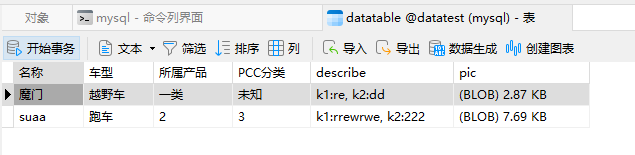

### **把excel数据存储到mysql中**

执行步骤
1. 在Helper中配置数据库信息（数据库url,用户名和密码）
2. 把main文件中的exlPath更换为指定excel的路径
3. 执行main函数

example:
成功添加

测试步骤
1. 在HelperTest中更改你插入数据库中的数据中的‘名称’字段
2. 运行HelperTest.test(),会把数据库中存储的图片输入到文件保存到本目录下

